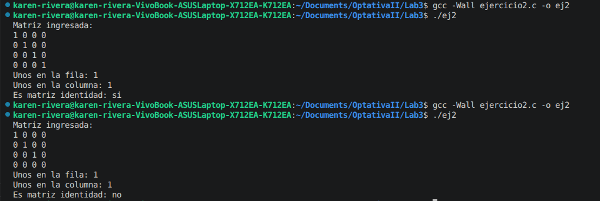
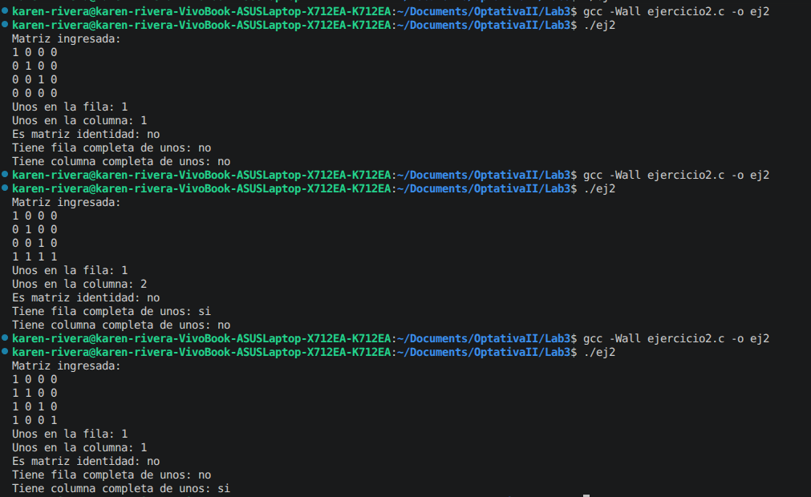
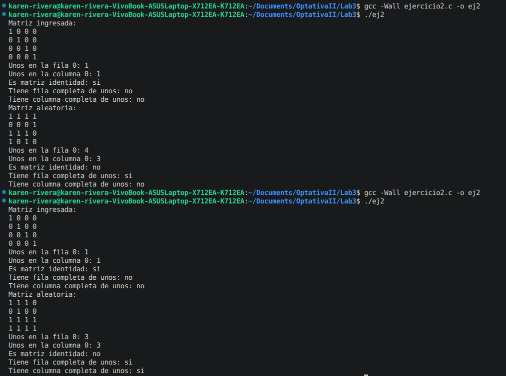
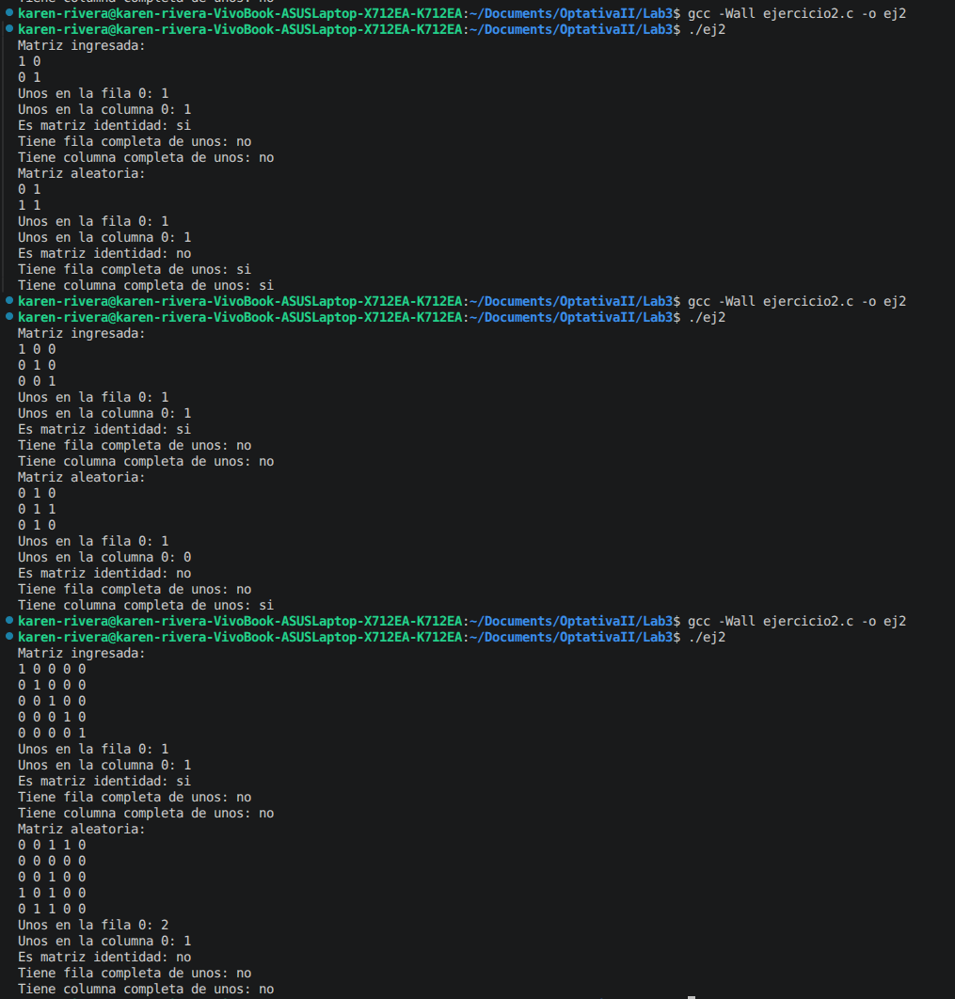

# Laboratorio 3
Karen Rivera Angulo 

C09197

---

## Ejercicio 1
### Correción de error
El código que calcula potencias enteras presenta un problema dentro del ciclo `while`. En la línea `int exp = exp - 1;` se crea una nueva variable local llamada `exp` en lugar de modificar la variable original. Como consecuencia, el valor del exponente nunca cambia, la condición del `while` siempre permanece verdadera y el ciclo se vuelve infinito.

```C
#include <stdio.h>

int potencia(int base, int exp) {
    int resultado = 1;
    while (exp > 0) {
        resultado = resultado * base;
        int exp = exp - 1;     // Error en el código al generar una nueva variable
    }
    return resultado;
}

int main(void) {
    printf("2^8 = %d\n", potencia(2, 8));
    printf("3^4 = %d\n", potencia(3, 4));
    return 0;
}
```

### Ingreso de variables por el usuario
Se genera el siguiente código para que el usuario pueda ingresar la base, validando que el número ingresado sea diferente de cero, y el exponente, verificando que el número sea mayor que cero.  

Estas validaciones se realizan mediante el uso del ciclo `do while`.

```C
int main(void){ 
    int base, exp;
 
    // Ingresar y validar base distinta de cero
    do {
        printf("Ingrese la base de la potencia: ");
        scanf("%d", &base);
        
        if (base == 0) { 
        printf("Número inválido, la base debe ser diferente de cero. ");
        }
    } while (base == 0);

    // Ingresar y validar exponente mayor a cero
    do {
        printf("Ingrese el exponente de la potencia: ");
        scanf("%d", &exp);

        if (exp < 0) {
            printf("Número inválido, el exponente debe ser mayor a cero. ");
        }

    } while (exp < 0);
   
    // Imprime el resultado de la potencia
    printf("%d^%d = %d\n", base, exp, potencia(base, exp));

    return 0;
}
```

En la siguiente imagen se puede observar el resultado del código anterior al digitar diferentes números confirmando que el código funciona correctamente.


### Verificación de si el resultado es par o impar
Por medio de la función `es_par(int n)` se verifica si el resultado obtenido es par o impar. Para ello, se divide el número entre dos y se comprueba si el residuo de la división es igual a cero.  

Si el residuo es cero, el número es par; en caso contrario, el número es impar, como se muestra en el siguiente código agregado.

```C
// Función para verificar si el resultado es par
int es_par(int n) {

    if (n % 2 == 0) {
        return 1;
    } else {
        return 0;
    }
}
```
Después de imprimir el resultado, se utiliza una estructura condicional `if` para mostrar si el número obtenido es par o impar, según corresponda.

```C
    // Verifica si el resultado es par 
    if (es_par(potencia(base, exp))) { 
        printf("El resultado es par.\n");
    } else {
        printf("El resultado es impar.\n");
    }
```
Se prueban ambos casos para verificar el correcto funcionamiento del código.


## Ejercicio 2
Se implementan cinco funciones para trabajar con una matriz binaria, cuyos elementos son únicamente 0 y 1.

### Contar unos en la fila y columna
Esta función se implementa mediante un ciclo `for` observado en el código, en el cual se recorre la matriz y se van sumando los valores cuando son iguales a 1.  

Este procedimiento es el mismo tanto para las filas como para las columnas de la matriz. En este caso, el recorrido se realiza específicamente sobre la fila 0 y la columna 0.

```C
// Contar cuantos unos hay en una fila
int contar_unos_fila(int m[][SIZE], int fila) {
    
    int i;
    int contador = 0;  //Inicia el contador en 0

    for (i = 0; i < SIZE; i++) {  //Recorre todos los números de la fila
        if (m[fila][i] == 1) { 
            contador ++;
        }
    }

    return contador;
}

```

### Identificar matriz identidad 
Para identificar si una matriz es identidad, se realiza un procedimiento similar al de contar unos en filas y columnas. Para esto se realiza primero el pseudocódigo.

```text
funcion es_identidad(matriz,n)

  for i desde 0 hasta n-1
    for j desde 0 hasta n-1
     
     if i == i=j entonces
        if matriz[i][j] != 1 entonces 
            devolver falso
        end if
    else
        if matriz[i][j] != 0 entonces
            devolver falso
        end if
    end for
  end for

  devolver verdadero

end funcion
```

Este se implementa mediante dos ciclos `for` que recorren las filas y las columnas, verificando si los valores en la diagonal principal son iguales a 1 y si los elementos restantes son iguales a 0.


```C
// Verifica si la matriz es identidad
int es_identidad(int m[][SIZE]) {

    int i, j;

    for (i = 0; i < SIZE; i++) {

        for (j = 0; j < SIZE; j++) {

            // Diagonal
            if (i == j) {

                if (m[i][j] != 1) {
                    return 0;
                }

            } else {

                // Numeros fuera de la diagonal
                if (m[i][j] != 0) {
                    return 0;
                }
            }
        }
    }

    return 1;
}
```

En la siguiente figura se pueden validar los resultados de las tres funciones mencionadas anteriormente, donde se cuentan los unos en la fila 0 y la columna 0, además de identificar si la matriz es identidad.  

Se realizó una pequeña modificación a la matriz ingresada para comprobar el correcto funcionamiento de las funciones.




### Verifica si tiene una fila y columna completa de unos
Se genera el pseudocódigo de la función.

```text
funcion tiene_fila_completa(matriz, n)
    
    for i desde 0 hasta n-1

        completa -> verdadero

        for j desde 0 hasta n-1 

            if matriz[i][j] != 1 entonces
                completa -> falso
            end if
        end for

        if completa == verdadero entonces
            devuelve verdadero
        end if

    end for

    devuelve falso

end funcion
```


De forma similar, se aplican dos ciclos `for` para recorrer la matriz y verificar si existen unos en toda la fila.  

Esta misma función se repite para el caso de las columnas.

```C
// Verifica si hay una fila completa de unos
int tiene_fila_completa(int m[][SIZE]) {

    int i, j;
    int completa;

    for (i = 0; i < SIZE; i++) {

        completa = 1;

        for (j = 0; j < SIZE; j++) {

            if (m[i][j] != 1) {
                completa = 0;
            }
        }

        if (completa == 1) {
            return 1;
        }
    }

    return 0;
}
```
En la siguiente figura se prueban las funciones modificando la matriz para obtener tres casos: no hay filas ni columnas completas de unos, existe una fila completa de unos y existe una columna completa de unos.  

Esto permite verificar que el código funciona correctamente sin importar la posición en la que se encuentre la fila o columna de unos.

 

### Generación de matriz aleatoria 
A continuación, se genera una matriz aleatoria utilizando `rand()%2`, la cual asigna a la variable `m2` valores aleatorios de 0 y 1 para cada elemento de la matriz.

Posteriormente, la matriz es impresa mediante dos ciclos `for`.

```C
int m2[SIZE][SIZE];

int i, j;

for (i = 0; i < SIZE; i++) { 
    for (j = 0; j < SIZE; j++) {
        m2[i][j] = rand() % 2;   //Genera matriz aleatoria
    }
}

    //Imprime matriz aleatoria
    printf("Matriz aleatoria:\n");

    for (i = 0; i < SIZE; i++) {

        for (j = 0; j < SIZE; j++) {

            printf("%d ", m2[i][j]);
        }

        printf("\n");
    }
```
Todas las funciones anteriores son utilizadas en el código para obtener los resultados de la matriz aleatoria. De este modo, los resultados para ambas matrices se muestran a continuación.



En este caso, el código se compila y ejecuta dos veces para obtener matrices distintas, con lo cual se confirma nuevamente que las funciones implementadas funcionan correctamente al contar los unos.

### Prueba con diferentes tamaños de matrices 
Finalmente, se modifica el tamaño de las matrices para determinar si las funciones se implementan correctamente sin importar sus dimensiones. En este caso, se utilizan matrices de 2x2, 3x3 y 5x5. Además, el programa ya funcionaba correctamente con una matriz 4x4.

Dado que se utiliza la constante `SIZE` en cada función, el recorrido por las filas y columnas no se ve afectado por el tamaño de la matriz, lo que permite su reutilización para diferentes dimensiones.

 

## Ejercicio 3