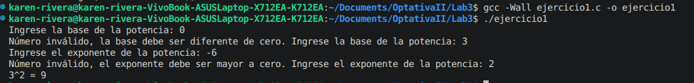
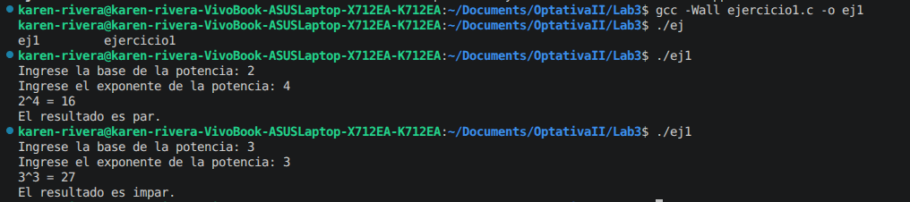

# Laboratorio 3
Karen Rivera Angulo 

C09197

---

## Ejercicio 1
### Correción de error
El código que calcula potencias enteras presenta un problema dentro del ciclo `while`. En la línea `int exp = exp - 1;` se crea una nueva variable local llamada `exp` en lugar de modificar la variable original. Como consecuencia, el valor del exponente nunca cambia, la condición del `while` siempre permanece verdadera y el ciclo se vuelve infinito.

```C
#include <stdio.h>

int potencia(int base, int exp) {
    int resultado = 1;
    while (exp > 0) {
        resultado = resultado * base;
        int exp = exp - 1;     // Error en el código al generar una nueva variable
    }
    return resultado;
}

int main(void) {
    printf("2^8 = %d\n", potencia(2, 8));
    printf("3^4 = %d\n", potencia(3, 4));
    return 0;
}
```

### Ingreso de variables por el usuario
Se genera el siguiente código para que el usuario pueda ingresar la base, validando que el número ingresado sea diferente de cero, y el exponente, verificando que el número sea mayor que cero.  

Estas validaciones se realizan mediante el uso del ciclo `do while`.

```C
int main(void){ 
    int base, exp;
 
    // Ingresar y validar base distinta de cero
    do {
        printf("Ingrese la base de la potencia: ");
        scanf("%d", &base);
        
        if (base == 0) { 
        printf("Número inválido, la base debe ser diferente de cero. ");
        }
    } while (base == 0);

    // Ingresar y validar exponente mayor a cero
    do {
        printf("Ingrese el exponente de la potencia: ");
        scanf("%d", &exp);

        if (exp < 0) {
            printf("Número inválido, el exponente debe ser mayor a cero. ");
        }

    } while (exp < 0);
   
    // Imprime el resultado de la potencia
    printf("%d^%d = %d\n", base, exp, potencia(base, exp));

    return 0;
}
```

En la siguiente imagen se puede observar el resultado del código anterior al digitar diferentes números confirmando que el código funciona correctamente.



### Verificación de si el resultado es par o impar
Por medio de la función `es_par(int n)` se verifica si el resultado obtenido es par o impar. Para ello, se divide el número entre dos y se comprueba si el residuo de la división es igual a cero.  

Si el residuo es cero, el número es par; en caso contrario, el número es impar, como se muestra en el siguiente código agregado.

```C
// Función para verificar si el resultado es par
int es_par(int n) {

    if (n % 2 == 0) {
        return 1;
    } else {
        return 0;
    }
}
```
Después de imprimir el resultado, se utiliza una estructura condicional `if` para mostrar si el número obtenido es par o impar, según corresponda.

```C
    // Verifica si el resultado es par 
    if (es_par(potencia(base, exp))) { 
        printf("El resultado es par.\n");
    } else {
        printf("El resultado es impar.\n");
    }
```
Se prueban ambos casos para verificar el correcto funcionamiento del código.




## Ejercicio 2

## Ejercicio 3